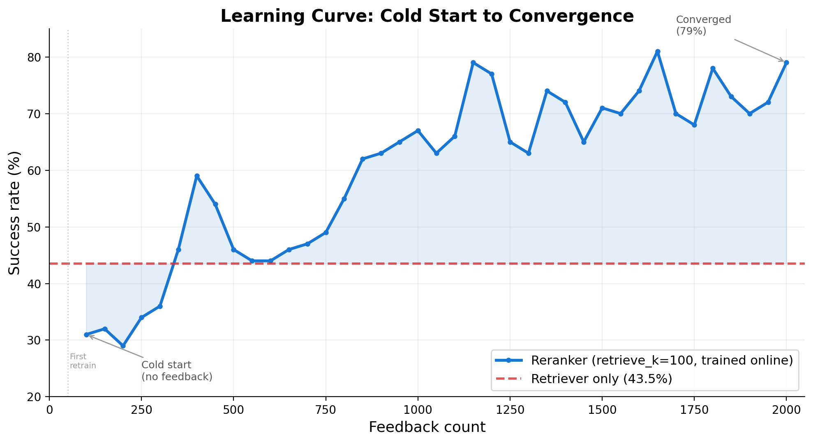
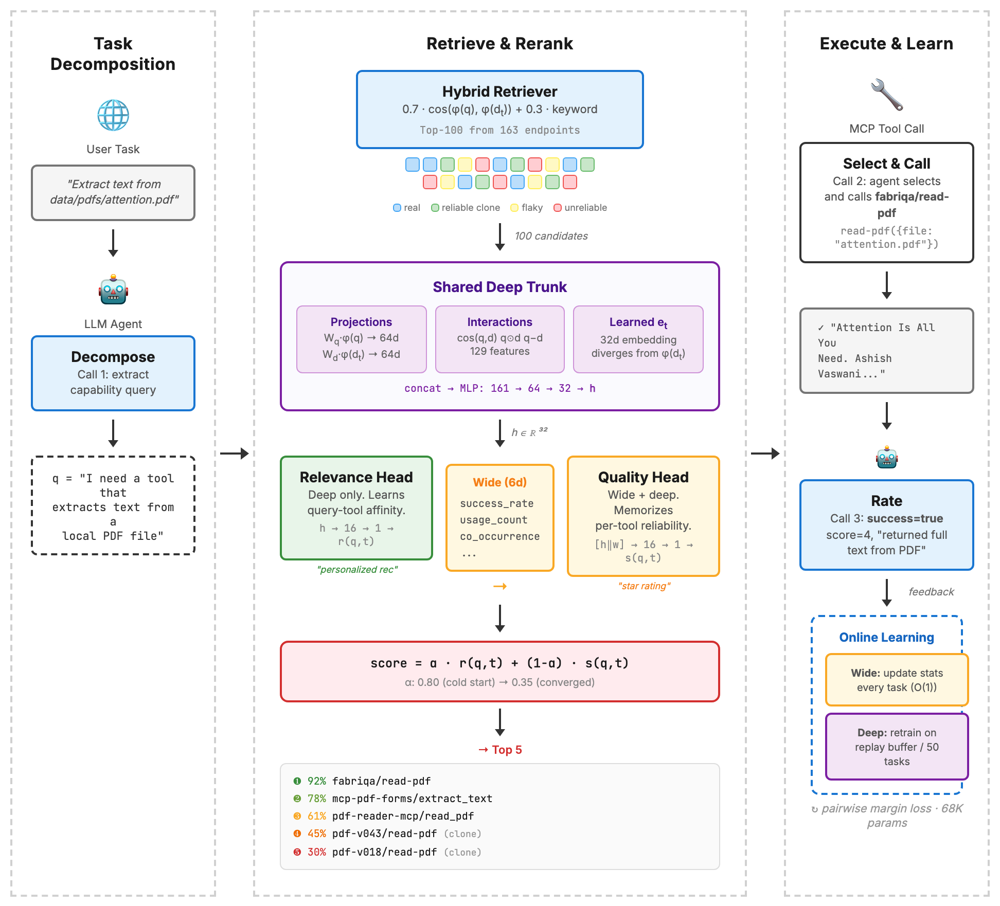

# Toolflix

**Feedback-driven tool recommendation for agentic systems.**

Agents need tools. MCP marketplaces now have thousands of endpoints, many with near-identical descriptions but wildly different reliability. A search tool might rank first by semantic similarity because its description literally says "search," while consistently returning empty results due to bot detection. Retrieval alone can't fix this. You need execution feedback.

Toolflix is a two-stage retrieve-then-rerank system that learns which tools actually work. A hybrid retriever surfaces 100 candidates. A two-head wide & deep reranker (68K params) selects the top 5, trained online from pairwise execution outcomes. The relevance head learns query-tool affinity through embeddings. The quality head memorizes per-tool success rates. Both improve from feedback with no human labels.

## Key Result

Trained on 2000 tasks across 163 endpoints (59 real MCP tools + 104 synthetic variants with controlled failure modes):

| | Retriever (clean pool) | Retriever (noisy pool) | Reranker (noisy pool) |
|---|---|---|---|
| **Overall** | 64.3% | 43.5% | **70.0%** |
| Search | 46% | 22% | **72%** |
| Fetch | 72% | 60% | **70%** |
| PDF | 82% | 50% | **78%** |

The reranker with a noisy tool pool outperforms the retriever with a curated pool. You don't need to curate your marketplace if you learn from feedback.





**[Full writeup on kevinzhang.ai →](https://kevinzhang.ai/toolflix.html)**

## Quickstart

```bash
# Install dependencies
pip install sentence-transformers torch openai python-dotenv

# Generate embeddings
cd scripts && python generate_embeddings.py

# Run the pipeline (requires OpenAI API key in .env)
cd src && python pipeline.py --limit 100 --concurrency 4
```

## Structure

```
src/
  retriever.py       # Hybrid retrieval (cosine + keyword, top 100)
  reranker.py        # Two-head wide & deep reranker
  agent.py           # 3-call agentic loop (decompose, select, rate)
  pipeline.py        # Orchestration + online learning
  mcp_client.py      # MCP tool execution + synthetic failure injection
  eval_reranker.py   # Offline evaluation

scripts/
  generate_solvable_tasks.py   # Task generation
  generate_synthetic_tools.py  # Synthetic variant generation
  generate_embeddings.py       # Embedding precomputation

data/
  tools.json                   # 120 servers, 163 endpoints
  feedback.jsonl               # Execution feedback
  test_tasks.json              # 200 held-out test tasks
```

## Paper

Full paper targeting NeurIPS 2026. Preprint forthcoming.
